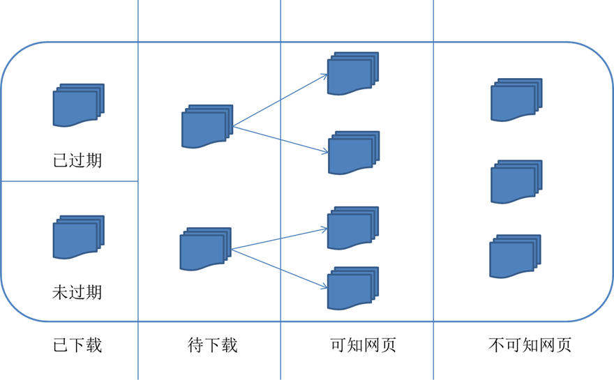

# 网络爬虫原理

## 爬虫是什么？

- 把互联网上的网页下载到本地形成一个互联网内容的镜像备份。

- 网络爬虫是捜索引擎抓取系统的重要组成部分。

## 爬虫简单流程

1. 首先选取一部分精心挑选的种子URL；

2. 将这些URL放入待抓取URL队列；

3. 从待抓取URL队列中取出待抓取在URL，解析DNS，并且得到主机的ip，并将URL对应的网页下载下来，存储进已下载网页库中。此外，将这些URL放进已抓取URL队列。

4. 分析已抓取URL队列中的URL，分析其中的其他URL，并且将URL放入待抓取URL队列，从而进入下一个循环。

## 从爬虫角度划分网页

1. 已下载未过期网页

2. 已下载已过期网页：抓取到的网页实际上是互联网内容的一个镜像与备份，互联网是动态变化的，一部分互联网上的内容已经发生了变化，这时，这部分抓取到的网页就已经过期了。

3. 待下载网页：也就是待抓取URL队列中的那些页面

4. 可知网页：还没有抓取下来，也没有在待抓取URL队列中，但是可以通过对已抓取页面或者待抓取URL对应页面进行分析获取到的URL，认为是可知网页。

5. 还有一部分网页，爬虫是无法直接抓取下载的。称为不可知网页。

## 抓取策略

### 深度优先遍历策略

- 从种子页面开始，对每个页面进行深度优先遍历
- 具体来说就是，遍历下载某个页面A时，遇到url_a1就爬入该url_a1(页面B)并下载，在页面B里遇到url_b1,就爬入该url_b1(页面C)并下载...一直递归到某个页面里的所有url都遍历完，才回溯到上一个页面，继续寻找下一个url。
- 例子：
　
- 按逆时针方向深度优先遍历结果为：
　A F-G E-H-I D C B

### 广度优先遍历策略

- 宽度优先遍历策略的基本思路是，将新下载网页中发现的链接直接插入待抓取URL队列的末尾。也就是指网络爬虫会先抓取起始网页中链接的所有网页，然后再选择其中的一个链接网页，继续抓取在此网页中链接的所有网页。
- 上面的例子按逆时针方向广度优先遍历结果为：
　A F-E-D-C-B G H I

### 反向链接策略

- 反向链接数是指一个网页被其他网页链接指向的数量。反向链接数表示的是一个网页的内容受到其他人的推荐的程度。因此，很多时候搜索引擎的抓取系统会使用这个指标来评价网页的重要程度，从而决定不同网页的抓取先后顺序。
- 在真实的网络环境中，由于广告链接、作弊链接的存在，反向链接数不能完全等于网页的重要程度。因此，搜索引擎往往考虑一些可靠的反向链接数。
