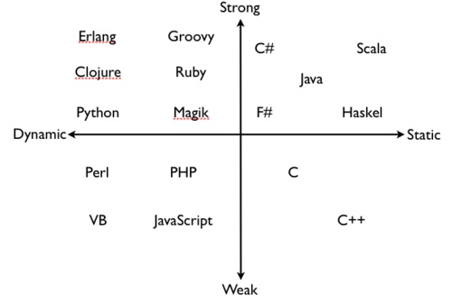

# 各种编程语言的分类

- 编译/解释型语言： 看翻译完再执行还是边翻译边执行
  - 编译型： 把英文稿子翻译为中文稿子再演讲，有(中间稿)中文稿
  - 解释型： 照着英文稿子一句一句讲中文
- 动态/静态语言： 看**运行时**是否能改变**代码结构**
- 动态/静态类型语言： 看**类型检查**在**编译期**还是**运行时**
- 强/弱类型语言： 看是否经常做**隐式类型转换**
- 两两间无必然联系

## 以下内容转自知乎

1. 先定义一些基础概念

### Program Errors

- trapped errors。导致程序终止执行，如除0，Java中数组越界访问
- untrapped errors。 出错后继续执行，但可能出现任意行为。如C里的缓冲区溢出、Jump到错误地址

### Forbidden Behaviours

语言设计时，可以定义一组forbidden behaviors. 它必须包括所有untrapped errors, 但可能包含trapped errors.

### Well behaved、ill behaved

- well behaved: 如果程序执行不可能出现forbidden behaviors, 则为well behaved。
- ill behaved: 否则为ill behaved...

2. 有了上面的概念，再讨论强、弱类型，静态、动态类型

### 强、弱类型

- 强类型strongly typed: 如果一种语言的所有程序都是well behaved——即不可能出现forbidden behaviors，则该语言为strongly typed。
- 弱类型weakly typed: 否则为weakly typed。比如C语言的缓冲区溢出，属于trapped errors，即属于forbidden behaviors..故C是弱类型

前面的人也说了，弱类型语言，类型检查更不严格，如偏向于容忍隐式类型转换。譬如说C语言的int可以变成double。 这样的结果是：容易产生forbidden behaviours，所以是弱类型的

### 动态、静态类型

- 静态类型 statically: 如果在编译时拒绝ill behaved程序，则是statically typed;
- 动态类型 dynamiclly: 如果在运行时拒绝ill behaviors, 则是dynamiclly typed。

3. 误区

大家觉得C语言要写int a, int b之类的，Python不用写(可以直接写a, b)，所以C是静态，Python是动态。这么理解是不够准确的。譬如Ocaml是静态类型的，但是也可以不用明确地写出来。。Ocaml是静态隐式类型

静态类型可以分为两种：

- 如果类型是语言语法的一部分，在是explicitly typed显式类型；
- 如果类型通过编译时推导，是implicity typed隐式类型, 比如ML和Haskell

4. 下面是些例子
- 无类型： 汇编弱
- 类型、静态类型 ： C/C++
- 弱类型、动态类型检查： Perl/PHP
- 强类型、静态类型检查 ：Java/C#
- 强类型、动态类型检查 ：Python, Scheme
- 静态显式类型 ：Java/C
- 静态隐式类型 ：Ocaml, Haskell
