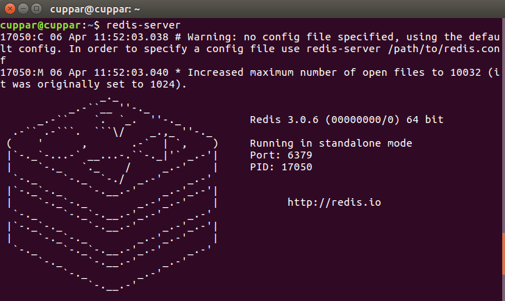
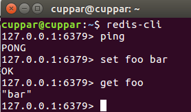
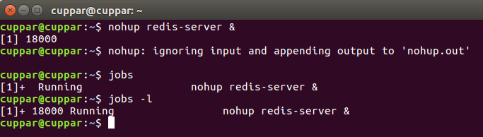
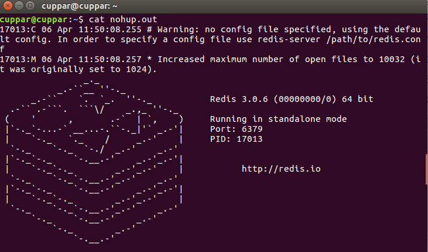

# Redis数据库 - REmote DIctionary Server

- 日志型、Key-Value数据库

## 支持的存储方式

- 基于网络 - 分布式
- 基于内存 - 快速存取
- 基于硬盘 - 持久化

## 支持的数据结构

- String
- Map
- list
- sets
- sorted sets

## 安装(Ubuntu)

- 安装

        $ sudo apt-get update
        $ sudo apt-get install redis-server

- 启动服务

        $ redis-server
    
- 启动客户端

        $ redis-cli
    
- 后台启动服务

    nohup命令: 不挂起

    命令后加 &: 后台运行

        $ nohup redis-server &

    jobs命令: 查看后台运行的进程

    -l 参数: 显示其进程号PID

        $ jobs
        $ jobs -l
    

    后台进程的输出会重定向到nohup.out文件

        $ cat nohup.out
    