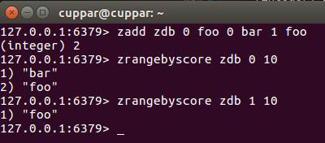

# Redis数据库 - REmote DIctionary Server

- 日志型、Key-Value数据库

## 支持的存储方式

- 基于网络 - 分布式
- 基于内存 - 快速存取
- 基于硬盘 - 持久化

## 支持的数据结构

- string
- hashMap
- list
- sets
- sorted sets

## 安装、启动、关闭(Ubuntu)

- 安装

        $ sudo apt-get update
        $ sudo apt-get install redis-server

- 启动服务

        $ redis-server

    
- 启动客户端

        $ redis-cli
        $ redis-cli -h host -p post -a password

    
- 后台启动服务

    nohup命令: 不挂起

    命令后加 &: 后台运行

        $ nohup redis-server &

    jobs命令: 查看后台运行的进程

    -l 参数: 显示其进程号PID

        $ jobs
        $ jobs -l

    

    后台进程的输出会重定向到nohup.out文件

        $ cat nohup.out

    

- 通过 service 启动和关闭

    启动服务

        $ sudo service redis-server start

    使用客户端

        $ redis-cli

    关闭服务

        $ sudo service redis-server stop

## 配置

- 启动时使用配置文件

        $ redis-server /etc/redis/redis.conf

- 通过修改配置文件 /etc/redis/redis.conf 内容配置
- 通过客户端命令进行配置

        $ redis-cli
        127.0.0.1:6379> config get [config-name]
        1) "[config-name]"
        2) "[value]"
        127.0.0.1:6379> config set [config-name] [new-value]
        OK

    

- 常用配置

    
    
    
    
    

## 数据结构

### string

    127.0.0.1:6379> set foo bar
    OK
    127.0.0.1:6379> get foo
    "bar"

### list

    127.0.0.1:6379> lpush ldb foo
    (integer) 1
    127.0.0.1:6379> lrange ldb 0 10
    1) "foo"

### hash

    127.0.0.1:6379> hmset hdb key1 hello key2 world
    OK
    127.0.0.1:6379> hget hdb key1
    "hello"
    127.0.0.1:6379> hget hdb key2
    "world"
    127.0.0.1:6379> hgetall hdb
    1) "key1"
    2) "hello"
    3) "key2"
    4) "world"

### set

    127.0.0.1:6379> sadd sdb foo bar
    (integer) 2
    127.0.0.1:6379> smenbers sdb
    1) "bar"
    2) "foo"

### sorted set

    127.0.0.1:6379> zadd zdb 0 foo 0 bar 1 foo
    (integer) 2
    127.0.0.1:6379> zrangebyscore zdb 0 10
    1) "bar"
    2) "foo"
    127.0.0.1:6379> zrangebyscore zdb 1 10
    1) "foo"

## KEY 管理

    127.0.0.1:6379> keys *

    127.0.0.1:6379> del key-name

