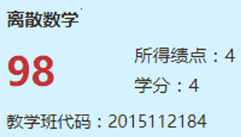
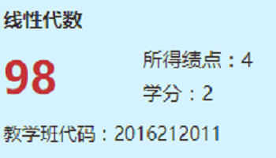
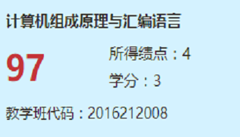
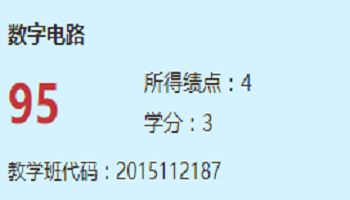
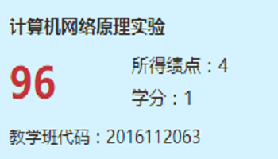
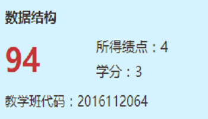
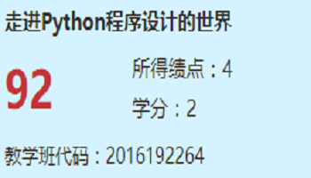
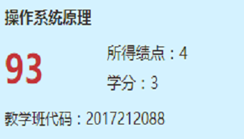
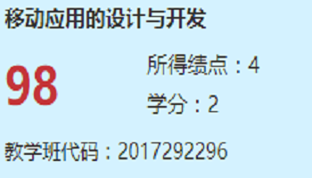

# 汉得-WEB前端-简历

## 联系方式

- 手机: 18213025244
- Email: cuppar.hzy@gmail.com
- qq: 981295188
- 微信: cuppar/18213025244

## 个人信息

- 何志颖/男/1996
- 本科(大三)/211/双一流/云南大学软件工程
- 个人博客: http://www.cuppar.com
- Github: https://github.com/cuppar

## 面试岗位

- WEB前端开发工程师

## 自我评价

- 最大优点: 学习能力强（一小时学会git和github工作流）
- 热爱coding: 觉得这是要坚持一生的事情。

## 技术栈

| 技术        | 使用时长 | 熟悉程度 |
| --------   | -----:  | :----: |
|前端↓|
| HTML    |  8月   |  熟悉   |
| CSS     |  8月   |  熟悉   |
| JavaScript |  6月   |  入门-熟悉   |
| Sass | 1月 | 入门 |
| vue.js |  1月   |  学习中  |
| node.js |  1月   |  学习中  |
| TypeScript |  1月   |  学习中  |
| 系统和工具↓ |
| Linux(笔记本ubuntu单系统)|  8月   |  熟悉   |
| git(github) |  8月  |  熟悉  |
| 后台↓ |
| Java SE  |  24月   |  熟悉   |
| Spring   |   1月   |  了解   |
| Spring MVC  |  1月 |  了解   |
| MyBatis     |  1月 |  了解   |
| tomcat      |  1月 |  了解   |
| Python      |  3月 |  入门   |
| Perl        |  1月 |  了解   |
| redis       |  1月 |  了解   |
| MySQL       |  3月 |  入门   |

## 学科基础

### 五学期平均GPA: 3.433(非编程相关有点垃圾)

