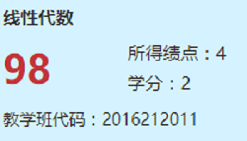
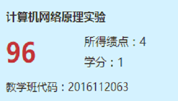
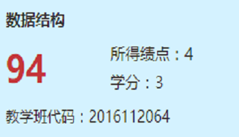
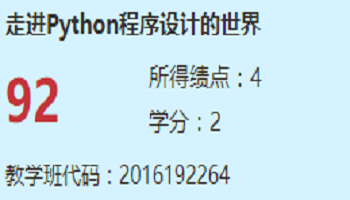
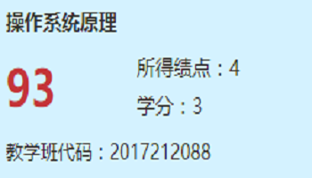
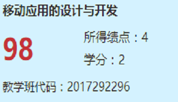

# WEB前端-简历

## 联系方式

- 手机: 18213025244
- Email: cuppar.hzy@gmail.com
- qq: 981295188
- 微信: cuppar/18213025244

## 个人信息

- 何志颖/男/1996
- 本科(大四)/211/双一流/云南大学软件工程
- 个人博客: http://www.cuppar.com
- Github: https://github.com/cuppar

## 面试岗位

- WEB前端开发工程师

## 自我评价

- 最大优点: 学习能力强（一小时学会git和github工作流）
- 高度责任心，做事认真，扣细节，有轻微强迫症
- 热爱coding: 觉得这是要坚持一生的事情
- 缺点: 比较腼腆，与陌生人交往，上台演讲，面试等会很紧张

## 技术栈

| 技术        | 使用时长 | 熟悉程度 |
| --------   | -----:  | :----: |
|前端↓|
| HTML    |  8月   |  熟悉   |
| CSS     |  8月   |  熟悉   |
| JavaScript |  8月   |  入门-熟悉   |
| Sass | 1月 | 入门 |
| react |  3月   |  熟悉  |
| vue.js |  1月   |  学习中  |
| node.js |  1月   |  学习中  |
| TypeScript |  1月   |  学习中  |
| 系统和工具↓ |
| Linux(笔记本linux单系统)|  8月   |  熟悉   |
| git(github) |  8月  |  熟悉  |
| 后台↓ |
| Java SE  |  24月   |  熟悉   |
| Spring   |   1月   |  了解   |
| Spring MVC  |  1月 |  了解   |
| MyBatis     |  1月 |  了解   |
| tomcat      |  1月 |  了解   |
| Python      |  3月 |  入门   |
| Perl        |  1月 |  了解   |
| redis       |  1月 |  了解   |
| MySQL       |  3月 |  入门   |

## 项目经验
- 在线博客平台
  - 项目简介: 类似csdn的一个博客平台，当然功能没有那么强大，普通用户和管理员两套系统，主要支持普通用户注册登录，md编辑、发表文章，编辑个人资料，文章分类，点赞、评论、收藏，管理员管理文章分类，删除不良文章及评论，对用户发文章、评论权限控制、冻结等。
  - 团队: 5人开发，我任组长，两前端，三后台
  - 技术路线
    - 架构: 前后端分离、restful API、Ajax
    - 前端: react
    - 后端: java ssm(spring boot)
    - 用户认证: json web token(JWT)
    - 数据库: mysql
    - Ajax: axios
  - 我负责的工作: 管理员前端系统开发、组织团队分工、开会、任务跟踪等

## 学科基础

### 五学期平均GPA: 3.433(非编程相关有点垃圾)

