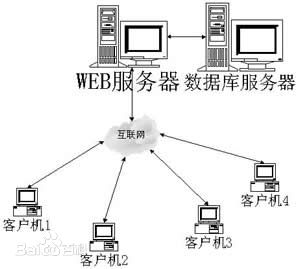
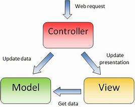
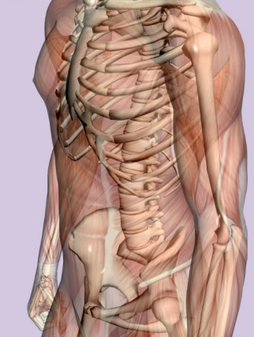
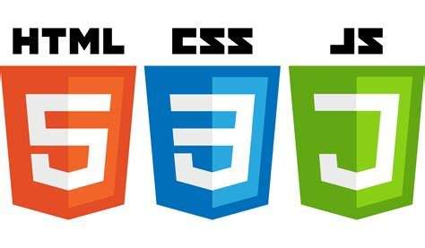

# WEB PAGE

_2018-4-8  学术英语  何志颖  20151120237_
___

- we use web page everyday, but
- ***Do you really know it?***

## What's the web page?

- web page is a window that help us to access the internet.

## Why we need the web page?

- to get data, information, knowledge
- to work, relax, do everything we want

### more more important is we need the **"Internet"**

- why?
- before has internet, the world like "Ford", the soybeans made of paint are made by themselves.
- after has internet, the world like "Boeing", 90% components are made all over the world.

## How the web page work?

- B/S: Browser/Server

- MVC: Model-View-Controler

- HTTP protocol

- URL: Uniform Resourse Locator

## How to make a web page?

- if web page is a human:

- HTML -- bone
- CSS -- appearance
- JAVASCRIPT -- muscle

___
_2018-4-8  学术英语  何志颖  20151120237_